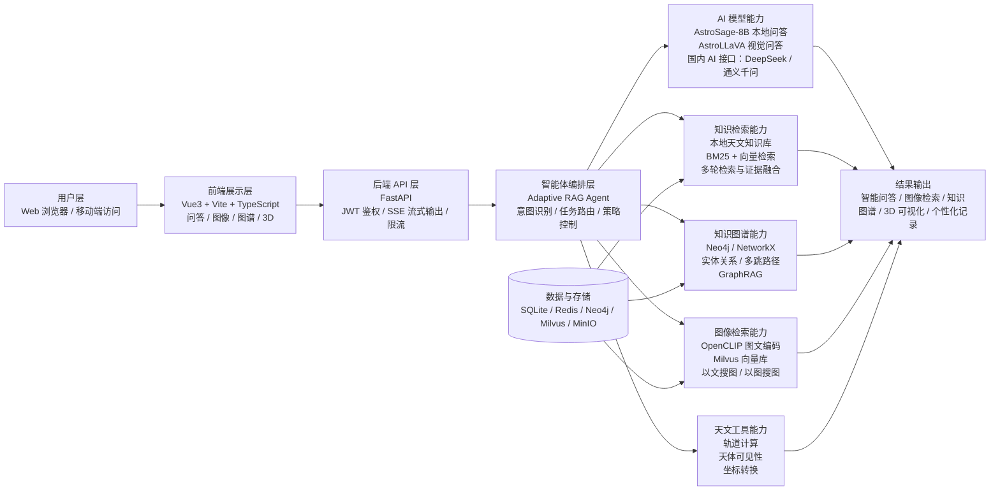

<p align="center">
  
  
  
  
  
  
</p>

<h1 align="center">星智穹图 ASTRO</h1>

<p align="center">
  <strong>面向天文科普与知识探索的多模态智能平台</strong>
</p>

<p align="center">
  连接智能问答、图像检索、知识图谱、前沿资讯与三维天体可视化，让天文问题变成一段可交互的探索旅程。
</p>

<p align="center">
  <a href="#项目简介">项目简介</a> ·
  <a href="#核心功能">核心功能</a> ·
  <a href="#系统架构">系统架构</a> ·
  <a href="#快速启动">快速启动</a> ·
  <a href="#技术亮点">技术亮点</a>
</p>

---

## 项目简介

**星智穹图 ASTRO** 是一个面向中文天文爱好者、学生与科普展示场景的 Web 应用。项目围绕“问答、检索、图谱、可视化”四类核心交互展开，后端通过自适应 RAG、知识图谱、图像向量检索和多模态模型能力，为用户提供更自然、更完整、更可探索的天文科普体验。

项目适用于：

- 天文科普网站与课堂演示
- 天文知识问答与图文解释
- 天文图片相似检索与以文搜图
- 天体关系发现、路径推理与知识图谱展示
- 太阳系与典型天体的三维可视化展示
- 中国计算机设计大赛 Web 应用与信息可视化方向作品展示

---

## 核心功能

| 模块 | 功能说明 |
| --- | --- |
| 智能问答 | 支持中文天文科普问答、上下文记忆、流式回答、图片问答和回答缓存 |
| 自适应 RAG | 根据问题复杂度自动决定是否检索、检索哪些知识源、是否进行多轮补充检索 |
| 知识图谱 | 支持实体查询、周边子图谱加载、节点详情、多跳路径发现、实体对比与 GraphRAG 增强 |
| 图像检索 | 支持以文搜图、以图搜图、Milvus 向量检索、本地索引兜底和图片去重 |
| 三维可视化 | 基于 Three.js 展示太阳系、行星、黑洞等典型天体模型，支持交互旋转与查询 |
| 前沿资讯 | 聚合 NASA APOD、arXiv astro-ph、天文事件与科普卡片，适合首页展示 |
| 个人中心 | 支持登录注册、历史问答、收藏天体、最近探索与推荐继续探索 |
| 评测面板 | 提供问答质量、响应耗时、缓存命中、检索链路等演示与答辩支撑能力 |

---

## 系统架构



---

## 技术栈

### 前端

| 技术 | 用途 |
| --- | --- |
| Vue 3 + Vite | 前端应用框架与构建工具 |
| TypeScript | 类型约束与工程可维护性 |
| Pinia | 全局状态管理 |
| Element Plus | 基础组件与交互控件 |
| ECharts | 知识图谱、实体对比、评测图表 |
| Three.js | 三维天体建模与交互可视化 |
| Marked | Markdown 科普回答渲染 |

### 后端

| 技术 | 用途 |
| --- | --- |
| FastAPI | 后端 API、SSE 流式接口、鉴权与限流 |
| SQLite | 用户、历史记录、缓存与轻量业务数据 |
| Redis | 热门问题、检索结果与图谱查询缓存 |
| Neo4j / NetworkX | 知识图谱存储、关系发现与路径推理 |
| Milvus | 图像向量库与相似图片检索 |
| MinIO | 图片对象存储，可选用于生产化部署 |
| Docker Compose | Neo4j、Milvus、MinIO、Redis 编排部署 |

### AI 与检索

| 能力 | 说明 |
| --- | --- |
| AstroSage-8B | 天文领域本地语言模型，用于专业科普问答 |
| AstroLLaVA | 天文图像理解与图文问答 |
| OpenCLIP ViT-B/32 | 图像与文本向量编码 |
| Sentence Transformers / BM25 | 文本语义检索与关键词检索 |
| Adaptive RAG Agent | 动态检索策略、证据融合、缓存命中与反思增强 |
| 国内 AI 接口 | 可配置 DeepSeek、通义千问等兼容接口作为质量增强兜底 |

---

## 技术亮点

### 1. 自适应 RAG，而不是机械检索

系统会根据问题复杂度自动选择不同策略：

- 简单问题：优先走模型或本地稳答路径，减少无意义检索。
- 中等问题：执行单轮知识库检索并进行科普化总结。
- 复杂问题：多轮检索，必要时联动知识图谱、动态数据和联网天文资料。

这种设计可以同时兼顾回答速度、准确率和演示稳定性。

### 2. 多源证据融合

问答链路不是单纯调用一个模型，而是综合使用：

- 本地天文知识库
- 知识图谱实体关系
- 图像检索结果
- NASA / arXiv 等动态数据
- 本地模型与可选国内云端模型

后端会对不同来源的证据进行整理、去重、优先级控制和回答生成。

### 3. 面向比赛演示的性能兜底

项目加入了多层稳定性设计：

- SSE 流式回答，减少“长时间无反馈”
- 热门问答缓存
- 知识卡片缓存
- 图谱查询缓存
- 图片检索缓存
- 检索 top-k 限制
- 图谱子图加载，避免一次性全量展开
- 视觉模型与 CLIP 预热
- 接口超时与友好降级提示

### 4. 多模态天文检索

图像模块基于 OpenCLIP 与 Milvus 构建图文向量索引，支持：

- 输入“木星大红斑”“环状星云”等文本检索相关图片
- 上传图片检索相似天文图像
- 图片去重与本地索引兜底
- 图片放大、保存、复制链接与收藏

### 5. 知识图谱与 GraphRAG

知识探索模块围绕实体关系展开：

- 输入实体后加载“该实体 + 周边关系”的子图谱
- 查看节点详情、类别、相关实体和关系路径
- 对两个天体进行属性对比与可视化
- 查询多跳路径，展示实体之间的间接关系
- 将图谱证据注入问答链路，提高复杂问题解释能力

---

## 快速启动

### 环境要求

| 依赖 | 建议版本 | 说明 |
| --- | --- | --- |
| Python | 3.11+ | 后端运行环境 |
| Node.js | 18+ | 前端构建环境 |
| npm | 9+ | 前端依赖管理 |
| Docker Desktop | 20+ | 启动 Milvus、Neo4j、MinIO、Redis |
| NVIDIA GPU | 可选 | 本地大模型与视觉模型加速 |

### 1. 克隆项目

```bash
git clone https://github.com/sherlockhomers/Astro.git
cd Astro
```

### 2. 启动基础设施

```bash
docker compose up -d
```

默认会启动：

- Neo4j: `http://localhost:7474`
- Milvus: `localhost:19530`
- MinIO: `http://localhost:9001`
- Redis: `localhost:6379`

### 3. 启动后端

```bash
cd backend
python -m venv .venv
.venv\Scripts\activate
pip install -r requirements.txt
copy .env.example .env
uvicorn app.main:app --host 127.0.0.1 --port 8000 --reload
```

后端地址：`http://127.0.0.1:8000`

API 文档：`http://127.0.0.1:8000/docs`

### 4. 启动前端

```bash
cd frontend
npm install
npm run dev
```

前端地址：`http://127.0.0.1:5173`

### 5. Windows 一键启动脚本

项目提供了本地演示启动脚本：

```powershell
powershell -ExecutionPolicy Bypass -File D:\Astro\scripts\start_astro_stack.ps1
```

该脚本会尝试启动 Docker Desktop、Milvus 和后端服务，并检查模型与图像索引状态。

---

## 关键配置

后端配置文件位于 `backend/.env`。常用配置如下：

```env
APP_ENV=dev
ALLOWED_ORIGINS=http://localhost:5173,http://127.0.0.1:5173

AUTH_SECRET=REPLACE_WITH_AT_LEAST_32_RANDOM_CHARS

NEO4J_ENABLED=true
NEO4J_URI=bolt://localhost:7687
NEO4J_USER=neo4j
NEO4J_PASSWORD=REPLACE_WITH_STRONG_PASSWORD

MILVUS_ENABLED=true
MILVUS_HOST=localhost
MILVUS_PORT=19530
MILVUS_COLLECTION=astro_image_clip

MINIO_ENABLED=false

CSV_ROOT=D:/Astro/天文学数据集.xlsx
IMAGE_BASE_DIRS=F:/astronomical_dataset/astronomical-image-and-csv-dataset/data/images
TEXT_CORPUS_ROOT=D:/Astro/backend/data/text_corpus

CLOUD_LLM_ENABLED=false
CLOUD_LLM_PROVIDER=deepseek
CLOUD_LLM_API_KEY=REPLACE_WITH_YOUR_KEY
CLOUD_LLM_MODEL=deepseek-chat
```

> 生产或公开部署时，请务必替换 `AUTH_SECRET`、数据库密码、MinIO 密钥和云端模型密钥。不要将真实密钥提交到 GitHub。

---

## 数据与索引

### 构建知识图谱

```bash
cd backend
python scripts/build_kg_from_csv.py
```

### 导入高质量文本知识库

```bash
cd backend
python scripts/ingest_hq_astronomy_corpus.py
python scripts/ingest_text_corpus.py
```

### 构建图像目录与 Milvus 索引

```bash
cd backend
python scripts/prepare_image_manifest.py
python scripts/index_milvus_clip.py
```

图像检索模块支持 Milvus 优先、本地索引兜底。比赛演示前建议确认：

```text
Milvus 端口：19530
图像索引状态：completed
向量数量：与图片目录去重后的有效图片数一致
```

---

## 项目结构

```text
Astro/
├─ frontend/                  # Vue 3 前端应用
│  ├─ src/views/              # Landing、QA、ImageSearch、Knowledge、Starfield 等页面
│  ├─ src/components/         # 图谱、3D、图像卡片等组件
│  ├─ src/router/             # 路由配置
│  ├─ src/stores/             # Pinia 状态管理
│  └─ src/api.ts              # API 客户端
├─ backend/                   # FastAPI 后端服务
│  ├─ app/routers/            # auth、qa、graph、image、landing、system 等路由
│  ├─ app/services/           # Agent、RAG、图谱、图像检索、模型服务
│  ├─ data/                   # 本地知识库、规则、缓存数据
│  ├─ models/                 # 本地模型适配器
│  └─ scripts/                # 数据清洗、索引构建、评测脚本
├─ data/                      # 项目数据文件
├─ docs/                      # 设计文档、演示材料与说明
├─ scripts/                   # 一键启动、PPT 图片生成、环境检查脚本
├─ compose.yaml               # Docker Compose 基础设施
└─ README.md                  # 项目说明文档
```

---

## 主要 API

| 模块 | 接口 | 说明 |
| --- | --- | --- |
| 系统状态 | `GET /api/v1/system/status` | 查看模型、知识库、图谱、向量库、缓存状态 |
| 用户认证 | `POST /api/v1/auth/register` | 用户注册 |
| 用户认证 | `POST /api/v1/auth/login` | 用户登录并签发 JWT |
| 智能问答 | `POST /api/v1/qa/ask` | 普通问答 |
| 智能问答 | `POST /api/v1/qa/stream` | SSE 流式问答 |
| 图片问答 | `POST /api/v1/qa/ask-with-image` | 上传图片并进行图文问答 |
| 图像检索 | `GET /api/v1/image/search-by-text` | 以文搜图 |
| 图像检索 | `POST /api/v1/image/search-by-image` | 以图搜图 |
| 知识图谱 | `GET /api/v1/visualization/subgraph` | 获取实体周边子图谱 |
| 知识图谱 | `GET /api/v1/graph/multi-path` | 多跳路径发现 |
| 可视化 | `GET /api/v1/visualization/*` | 图谱和 3D 可视化数据 |
| 首页内容 | `GET /api/v1/landing/*` | APOD、arXiv、科普卡片等首页数据 |

完整接口以启动后的 Swagger 文档为准：`http://127.0.0.1:8000/docs`。

---

## 比赛展示工作量

本项目不仅是页面展示，还包含较完整的 AI 应用工程链路：

1. **数据工程**：清洗 Excel、NASA、APOD、arXiv、图片数据集，构建文本知识库、图谱数据与图像索引。
2. **智能体编排**：实现意图识别、任务路由、动态 RAG、多轮检索、证据融合和回答缓存。
3. **多模态能力**：接入本地天文语言模型、视觉问答模型和 CLIP 图文向量检索。
4. **知识图谱**：支持实体关系、子图谱、路径发现、实体对比和 GraphRAG 增强问答。
5. **性能优化**：流式输出、缓存、懒加载、索引兜底、接口超时、图谱分级加载和模型预热。
6. **工程安全**：JWT 鉴权、刷新令牌、CORS 白名单、限流、配置隔离和敏感信息不入库。
7. **可演示性**：提供系统状态、评测面板、典型问答、图像检索和知识探索闭环。

---

## 开发命令

### 前端

```bash
cd frontend
npm run dev
npm run build
npm run type-check
npm run lint
```

### 后端

```bash
cd backend
uvicorn app.main:app --reload --port 8000
python scripts/enterprise_smoke_check.py
python scripts/load_test.py
```

### Docker

```bash
docker compose up -d
docker compose ps
docker compose logs -f milvus-standalone
```

---

## 开源与声明

- 本项目用于天文科普、学习研究与比赛展示。
- 项目中涉及的公开数据来源包括 NASA、arXiv、CDS Aladin、NASA Exoplanet Archive 等。
- 本项目可配置本地模型与国内云端模型接口，实际部署时请遵守对应模型与数据源的许可协议。
- 若使用第三方模型权重或数据集，请根据其开源协议进行下载、部署与引用。

---

## License

This project is released under the MIT License. See `LICENSE` for details.